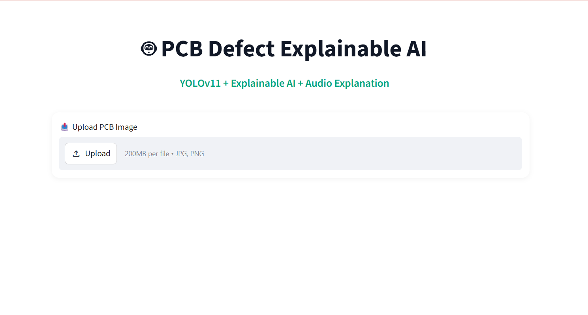

# PCB Defect detection and defect explantion AI

## About the Project
PCBExplainAI is a smart PCB defect detection and explanation system built using YOLOv11 and TinyLlama.

This project detects PCB defects from uploaded images using a custom-trained YOLOv11 model. After detecting the defect, TinyLlama generates a detailed explanation about the problem, including:
- introduction about the defect
- root cause analysis
- impact on PCB performance
- recommended solutions
- prevention methods
- final conclusion

The system also provides voice-based explanations for better understanding and interaction.

---

## Features
- PCB defect detection using YOLOv11
- AI-generated explanations using TinyLlama
- Root cause and impact analysis
- Repair and prevention suggestions
- Voice/audio explanation
- Simple Streamlit web interface

---

## Defects Detected
- Excessive
- Good
- Not Good
- Poor
- Spike

---

## Technologies Used
- Python
- YOLOv11
- TinyLlama
- Streamlit
- OpenCV
- PyTorch
- Hugging Face Transformers
- gTTS

---

## How It Works
1. Upload a PCB image
2. YOLOv11 detects the defect
3. TinyLlama generates a detailed explanation
4. Audio explanation is generated for the user

---

## Installation

```bash
pip install -r requirements.txt
streamlit run app.py
```

---

## Goal of the Project
The main goal of this project is to automate PCB defect detection and provide easy-to-understand AI-generated explanations for better defect analysis and understanding.

---

## Future Improvements
- Real-time PCB inspection
- Multilingual voice explanations
- Mobile application support
- Cloud deployment

---
---

## Project Screenshots

### Home Page


### Input PCB Image


### Defect Detection Result


### Defect 1 Explanation


### Defect 1 Explanation with Audio


### Defect 2 Explanation


### Defect 2 Explanation with Audio


## Author
Veeresh B Muragod
ECE Student | Machine Learning & Generative AI Enthusiast
